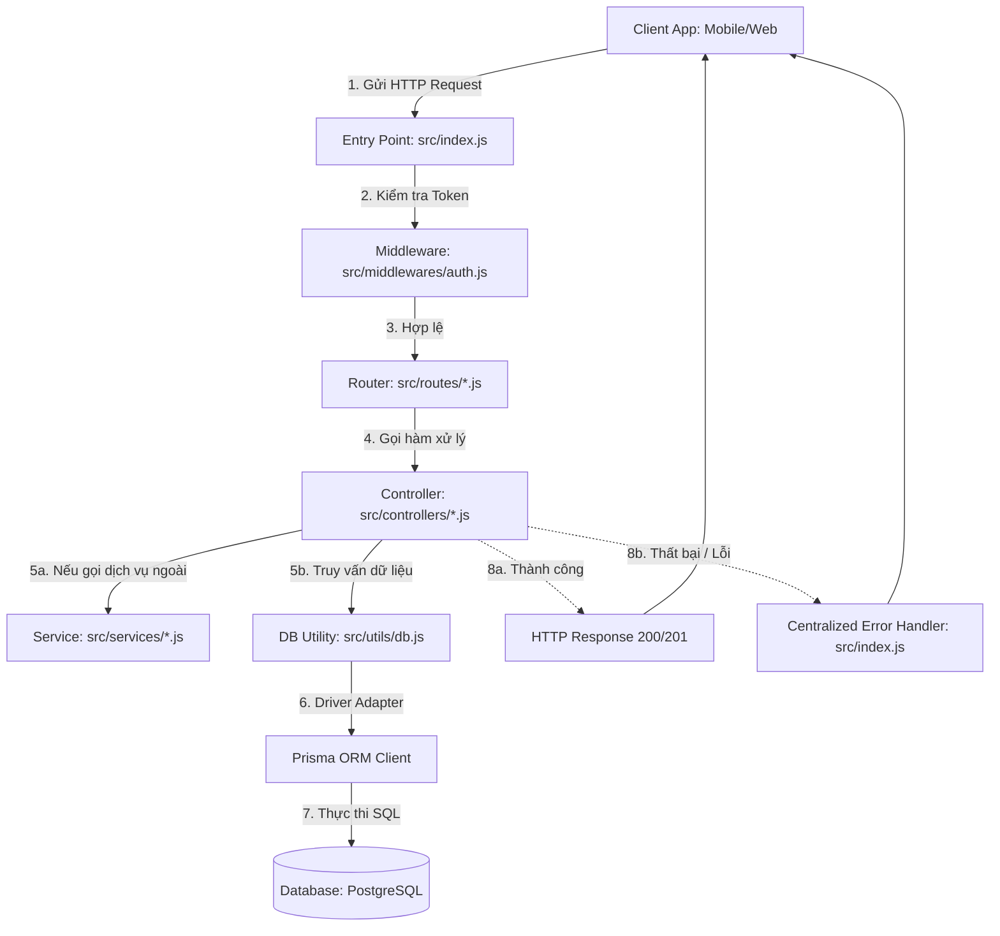

# Luồng Di Chuyển Dữ Liệu Trong Backend API 🥩

Tài liệu này giải thích chi tiết luồng đi của dữ liệu (Data Flow) khi Client (Mobile/Web) gửi yêu cầu (Request) lên Node.js Backend cho đến khi nhận được phản hồi (Response) từ cơ sở dữ liệu PostgreSQL.

---

## 🗺️ Sơ Đồ Tổng Quan Cấu Trúc Luồng Đi


---

## 🏃‍♂️ Luồng Di Chuyển Chi Tiết Của Một Request
*(Ví dụ thực tế: Lấy danh sách khách hàng của chủ buôn `GET /api/v1/customers`)*

### 1. Tiếp nhận Request (HTTP Request)
Client gửi yêu cầu HTTP GET tới địa chỉ `http://localhost:3000/api/v1/customers`.
Trong Header của Request có đính kèm Access Token để xác thực danh tính:
`Authorization: Bearer <JWT_ACCESS_TOKEN>`

### 2. Cổng vào Express (Entry Point)
File [src/index.js](file:///d:/meat-management/meat-management-be/src/index.js) tiếp nhận yêu cầu đầu tiên. Tại đây sẽ áp dụng các middleware bảo mật và đọc dữ liệu chung:
- `helmet()`: Bảo vệ các header HTTP.
- `cors()`: Cho phép Client từ các cổng/domain khác kết nối.
- `express.json()`: Giải mã body của request từ định dạng JSON.
- `rateLimit()`: Ngăn chặn Spam request từ một địa chỉ IP.

### 3. Điều hướng (Routing)
Yêu cầu khớp với tiền tố `/api/v1/customers` nên Express điều hướng request sang file định tuyến [src/routes/customer.js](file:///d:/meat-management/meat-management-be/src/routes/customer.js).

### 4. Kiểm tra quyền truy cập (Authentication Middleware)
Trong [src/routes/customer.js](file:///d:/meat-management/meat-management-be/src/routes/customer.js), route `/` được bảo vệ bởi middleware xác thực:
```javascript
router.get('/', protect, getCustomers);
```
Request sẽ đi qua hàm `protect` trong [src/middlewares/auth.js](file:///d:/meat-management/meat-management-be/src/middlewares/auth.js) trước:
- Middleware kiểm tra sự tồn tại của Token trong header `Authorization`.
- Giải mã và xác thực token bằng `jsonwebtoken` và mã bí mật `JWT_ACCESS_SECRET`.
- Nếu token hợp lệ, lấy ra thông tin chủ buôn (`id`, `phone`) và gán vào request (`req.user = decoded`), sau đó gọi hàm `next()` để tiếp tục.
- Nếu không hợp lệ hoặc hết hạn, ném ra lỗi `UnauthorizedError` để nhảy thẳng về trình xử lý lỗi tập trung.

### 5. Xử lý nghiệp vụ chính (Controller)
Hàm xử lý `getCustomers` trong [src/controllers/customer.js](file:///d:/meat-management/meat-management-be/src/controllers/customer.js) được kích hoạt:
- Controller lấy ID của chủ buôn đang đăng nhập từ `req.user.id`.
- Thực hiện gọi câu lệnh lấy dữ liệu từ Prisma:
  ```javascript
  const customers = await prisma.customer.findMany({
    where: { userId, isActive: true },
    include: { transactions: true, payments: true }
  });
  ```

### 6. Kết nối và Truy vấn Cơ sở dữ liệu (Database Query)
Câu lệnh trên gọi thông qua thực thể `prisma` được khởi tạo tại [src/utils/db.js](file:///d:/meat-management/meat-management-be/src/utils/db.js):
- `prisma` được cấu hình sử dụng driver adapter `@prisma/adapter-pg` kết hợp với thư viện kết nối PostgreSQL truyền thống `pg` (Pool).
- Pool kết nối sẽ lấy một kết nối có sẵn, thực thi truy vấn SQL tương ứng xuống cơ sở dữ liệu **PostgreSQL** chạy trong container Docker.
- Dữ liệu trả về cho Prisma Client dưới dạng các Object Javascript sạch sẽ.

### 7. Tính toán & Định dạng phản hồi (Response)
- Controller nhận danh sách khách hàng thô từ Prisma.
- Thực hiện tính toán nghiệp vụ: Tính toán số tiền nợ thực tế của từng khách hàng bằng cách lấy tổng tiền hóa đơn ghi nợ (`totalAmount` của `transactions`) trừ đi tổng số tiền khách đã trả (`amount` của `payments`).
- Sau khi tính toán xong, controller đóng gói dữ liệu và trả về phản hồi thành công JSON cho Client:
  ```javascript
  res.status(200).json({
    success: true,
    data: dataWithDebt,
  });
  ```

---

## 🛠️ Trình Tự Xử Lý Khi Gặp Lỗi (Exception Handling Flow)
Nếu có bất kỳ lỗi nào xảy ra ở bất kỳ bước nào (ví dụ: lỗi kết nối Database, nhập dữ liệu sai định dạng, bản ghi không tồn tại):
1. Code sẽ nhảy vào khối `catch (error)` ở Controller hoặc Middleware và gọi hàm chuyển tiếp lỗi: `next(error)`.
2. Express tự động chuyển lỗi này về **Trình xử lý lỗi tập trung (Error Handler Middleware)** ở cuối file [src/index.js](file:///d:/meat-management/meat-management-be/src/index.js).
3. **Phân loại lỗi:**
   - **Lỗi nghiệp vụ chủ động (`AppError`):** (Ví dụ: sai OTP, trùng số điện thoại). Trình xử lý lỗi sẽ trả về HTTP Status phù hợp (400, 401, 404) kèm theo thông điệp thông báo lỗi cụ thể để Client hiển thị lên giao diện cho người dùng sửa.
   - **Lỗi hệ thống thô:** (Ví dụ: đứt kết nối Database, lỗi cú pháp). Trình xử lý lỗi sẽ ghi lại chi tiết lỗi kèm vết mã nguồn (Stack Trace) vào file log [logs/error.log](file:///d:/meat-management/meat-management-be/logs/error.log) của server. Tuy nhiên, nó sẽ **ẩn thông tin thô** đi và chỉ trả về phản hồi chung dạng `500 Internal Server Error` với thông điệp: `"Đã có lỗi xảy ra trên máy chủ. Vui lòng thử lại sau."` để bảo mật hệ thống.

---

## 📁 Vai Trò Chi Tiết Của Các File & Thư Mục

| Thư mục / File | Vai trò và nhiệm vụ chính |
| :--- | :--- |
| **`src/index.js`** | File chạy chính của server. Khởi tạo Express, cấu hình middleware bảo mật, khai báo định tuyến API, và chứa bộ xử lý lỗi tập trung. |
| **`src/routes/`** | Định nghĩa các đường dẫn URL của API (ví dụ: `/api/v1/auth`, `/api/v1/customers`) và gán các hàm middleware bảo vệ hoặc controller xử lý tương ứng. |
| **`src/middlewares/auth.js`** | Chứa hàm kiểm tra tính hợp lệ của JSON Web Token (JWT) được gửi kèm ở mỗi request để đảm bảo người dùng đã đăng nhập hợp lệ. |
| **`src/controllers/`** | Chứa logic nghiệp vụ chính của ứng dụng. Đọc dữ liệu từ Client gửi lên, kiểm tra sơ bộ, tương tác với Database thông qua Prisma và định dạng gói JSON trả về. |
| **`src/services/esms.service.js`** | Dịch vụ tích hợp gửi tin nhắn SMS OTP. Hỗ trợ chế độ chạy thật và chế độ giả lập (Mock Mode) ghi mã OTP ra file [logs/sms.log](file:///d:/meat-management/meat-management-be/logs/sms.log). |
| **`src/utils/db.js`** | Nơi duy nhất khởi tạo kết nối Database PostgreSQL. Gắn kết driver adapter `pg` Pool vào Prisma Client để tối ưu hiệu suất và tương thích với Prisma v7. |
| **`src/utils/errors.js`** | Định nghĩa danh sách lỗi chuẩn của ứng dụng (Bad Request - 400, Unauthorized - 401, Not Found - 404...) thừa kế từ lớp `Error` mặc định của Javascript. |
| **`prisma/schema.prisma`** | Bản thiết kế mô tả toàn bộ cấu trúc các bảng (User, OTP, Customer, Product, Transaction, Payment) và mối quan hệ giữa chúng trong Database. |
